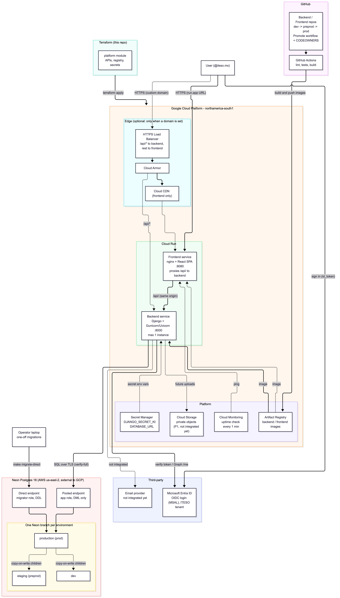

# GreenITESO Infra

This repo has two parts:

- **[`neon-db/`](neon-db/README.md)** — Neon Postgres operations docs and tooling (inventory, quotas, roles, recovery, monitoring). This is the actual, currently-used database infrastructure. See its own README for the full index.
- **Terraform (this directory)** — a scaffold for the GCP resources around the app (Cloud Run, optional edge network, storage, monitoring), matching the diagram below. GitHub verifies the scaffold; current provider resources and deployment state are unknown — see [Status](#status) below.

**Database readiness — 2026-10-01:** Neon dev/staging have 38 matching migration
records; current Backend dev expects 54. Shared dev seed inconsistencies need
review; PR #30/#34 remain unmerged and shared migrations have not run through
the release pipeline. The authorized [PITR drill](neon-db/docs/evidence/pitr-2026-10-01.md)
passed on disposable copies using #34's verifier; both copies were deleted.
See the [dated readiness evidence](neon-db/docs/evidence/database-readiness-2026-10-01.md)
and [deployment handoff](docs/deployment-handoff-2026-10-01.md) for architecture
changes, the approved `prod` Git target and demo prerequisites.

## Architecture



Summary:

- **Edge** (optional, only when `domain` is set): HTTPS load balancer → Cloud Armor → Cloud CDN, with `/api/*` routed to the backend and everything else to the frontend. Without a domain, users hit the frontend's `run.app` URL and its nginx proxies `/api/` to the backend, so the browser sees one origin (the production Backend has CORS disabled).
- **Compute target**: two Cloud Run services, backend and frontend; deployed runtime unverified. The backend is pinned to one instance (in-memory notification channel layer).
- **Persistence**: the diagram shows Cloud SQL, but **the actual database is Neon Postgres** (external to GCP) — see [`neon-db/docs/neon-inventario.md`](neon-db/docs/neon-inventario.md). There is no Cloud SQL module here. Fernando confirmed on 2026-10-01 the Git targets `dev` → Neon `dev`, `preprod` → `staging`, and `prod` → `production`; the final release path is not active yet. The GitHub Environment remains named `production`. The Cloud Storage module targets private object evidence (proposal P1); live bucket state is unverified.
- **CI/CD & observability**: Backend [PR #30](https://github.com/GreenITESO-Proyecto-Integrador/GreenITESO-Backend/pull/30) is ready for review with green CI, but its migration-gated release path has not run after a protected merge. The four required secrets are configured in each `dev`/`preprod` GitHub Environment; runner authentication is unverified. Cloud Run/Secret Manager require an inventory of existing GCP resources. The monitoring scaffold defines a one-minute uptime check; actual monitoring is unverified.
- **Third-party**: Microsoft Entra ID was merged into Backend `dev` in PR #93 on 2026-09-22; deployed runtime status is not verified. It is external and not provisioned here.

## Layout

```
main.tf                    # wires the modules for one environment
variables.tf                # project_id, project_number, images, Entra client ID, ...
providers.tf / versions.tf   # google/google-beta provider + version pins
outputs.tf                   # frontend/backend URLs, registry, secret IDs, ...
terraform.tfvars.example     # copy to terraform.tfvars (gitignored) and fill in
modules/
  platform/      # enabled APIs, Artifact Registry repo, empty Secret Manager secrets
  compute/       # one Cloud Run service (instantiated twice: backend, frontend)
  storage/       # Cloud Storage bucket (private object evidence, P1)
  monitoring/    # Uptime check (1 min) + alert policy
  network/       # ALB + Armor + CDN + path routing  (only if `domain` is set)
```

Run this once **per environment** (`dev`, `staging`, `production`), each with its own tfvars and state prefix. The environment value matches the Neon branch (`DJANGO_ENV` takes the same value); the Git release branches are `dev`, `preprod`, `prod`.

## Deploying an environment

Prerequisites outside Terraform: a GCS bucket for state (add a `backend "gcs"` block to `providers.tf`), the Neon pooled app URL for that environment from Fernando, the Entra client ID, and Entra owner adding `<frontend_url>/login` as an SPA redirect URI.

1. `terraform apply -target=module.platform` — enables APIs, creates the registry and the empty secrets.
2. Add secret values (never in tfvars): `python3 -c "import secrets; print(secrets.token_urlsafe(64))" | gcloud secrets versions add greeniteso-<env>-django-secret-key --data-file=-` and the same for `greeniteso-<env>-database-url` (pooled URL, `sslmode=verify-full`).
3. Build and push `backend` and `frontend` images to the `image_repository` output (`--platform linux/amd64`). Frontend build args: `VITE_API_BASE_URL=<frontend_url>`, `VITE_MICROSOFT_CLIENT_ID`, `VITE_MICROSOFT_AUTHORITY`. Put the image digests in tfvars.
4. `terraform plan`, review, `terraform apply`.
5. Run migrations once with the direct (unpooled) Neon URL from a trusted machine: `DJANGO_ENV=<env> DJANGO_DEPLOYED=true DJANGO_CONNECTION_ROLE=direct DATABASE_URL_UNPOOLED=... make -C app migrate-direct` (plus `DJANGO_SECRET_KEY` and `DJANGO_ALLOWED_HOSTS`). The direct URL is deliberately not stored in GCP.
6. Sign in on `frontend_url` with an `@iteso.mx` account.

The frontend image must serve the SPA on port 8080 with an `index.html` fallback and proxy `/api/` to `$BACKEND_URL`, sending `Host: $BACKEND_HOST` (Cloud Run routes by Host). The Frontend repo has no such Dockerfile yet.

## Status

GitHub establishes an unapplied scaffold at its original commit. Isaac now
reports GCP access through Nicolas, as shared by Fernando on 2026-10-01;
current provider resources remain unverified. Before planning changes, verify these inputs against
the existing account and resources:

- No GCP project/configuration was available to verify (`var.project_id` has no default, on purpose)
- No remote state backend is configured (`providers.tf` has no `backend` block — create the GCS bucket and add one before the first real apply)
- Container image/registry/digest: none verified in the inspected GitHub deployment evidence
- Secret Manager: `modules/platform` creates `greeniteso-<env>-django-secret-key` and `greeniteso-<env>-database-url` (empty); values come from Fernando (Neon URL) and `gcloud`. See [`neon-db/docs/neon-operations.md`](neon-db/docs/neon-operations.md) T4 for the role/URL contract.
- Existing GCP resources: this configuration assumes a fresh project. If anything (APIs, buckets, services) was already created by hand, `terraform import` it or read `terraform plan` carefully first.
- Domain ownership/DNS: unverified; HTTPS listener/cert resources are conditional on `var.domain`

The recorded scaffold checks passed `terraform fmt -check -recursive` and
`terraform validate` using Terraform **1.9.8** with `terraform init -backend=false`;
this validates configuration only. No GCP plan or apply was run by this audit.

Inventory the existing GCP account/resources before completing this scaffold
or enabling the app repos' `_deploy.yml` templates; use the canonical migration
gate rather than activating a second release path.
