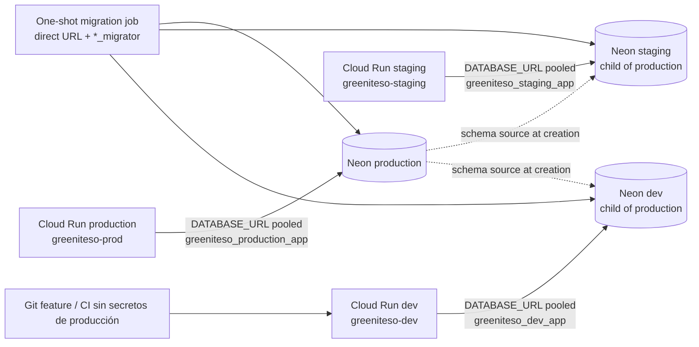

# Operación de ramas y roles Neon (T3/T4/T13)

Verificado el **2026-09-11** con Neon CLI **4.16.0**. Este runbook deja
preparada la operación y sus pruebas locales. No contiene cadenas de conexión,
contraseñas, tokens ni valores de GCP. Las operaciones que cambian Neon deben
ejecutarse con el proyecto y la rama explícitos, por el responsable de Infra,
después de revisar el destino.

## Mapa de ambientes

| Ambiente | Cloud Run previsto | Rama Neon | Branch ID | Endpoint ID | Rol app | Rol migrator |
| --- | --- | --- | --- | --- | --- | --- |
| dev desplegado | `greeniteso-dev` | `dev` | `br-wild-leaf-axhsrol6` | `ep-lively-brook-ax4n0pys` | `greeniteso_dev_app` | `greeniteso_dev_migrator` |
| staging | `greeniteso-staging` | `staging` | `br-long-band-axwyo7yx` | `ep-withered-cake-axk8vlfi` | `greeniteso_staging_app` | `greeniteso_staging_migrator` |
| producción | `greeniteso-prod` | `production` | `br-falling-forest-axgavkxc` | `ep-old-salad-axvsz82z` | `greeniteso_production_app` | `greeniteso_production_migrator` |

`dev` y `staging` son ramas hijas de `production`, creadas el 2026-09-11 con
el tamaño solicitado `0.25-1` CU y `--no-secrets`. El plan Free rechazó el
flag `--suspend-timeout 300`; al omitirlo, ambas usan el valor global observado
de 300 segundos y no tienen expiración. No se afirma aquí que exista un
servicio Cloud Run desplegado: la región, los nombres reales y las identidades
de GCP siguen siendo entradas que debe verificar el responsable de Cloud.

Una rama hija copia roles y bases de datos del padre. Por ello, la creación de
ramas no es una frontera de credenciales: el propietario copiado no se usa en
Cloud Run, y los roles únicos de la tabla se crean después de confirmar cada
destino. El desarrollo local usa PostgreSQL 18 desechable/devcontainer y no la
rama cloud `dev`.



Los despliegues de aplicación usan el rol `*_app` a través del hostname pooled
de Neon. Django migrations, dumps y operaciones que necesitan estado de sesión
usan el rol `*_migrator` a través del hostname directo. El pooler no se usa
para migrations.

## Inventario y creación de ramas

El plan local de solo lectura exige ambos identificadores y nunca descarga
variables de entorno:

```bash
scripts/neon-branches-plan.sh \
  --project-id cool-mouse-83825858 \
  --parent production
```

El script acepta el arreglo JSON que entrega CLI 4.16.0, muestra IDs y padres,
y solo imprime un comando para un target que falte. Si encuentra la rama,
imprime una instrucción para verificar el padre en vez de proponer duplicarla.
La creación aprobada se ejecutó con estas formas secret-free:

```bash
neon branches create --project-id cool-mouse-83825858 --parent production \
  --name staging --cu 0.25-1 --no-secrets
neon branches create --project-id cool-mouse-83825858 --parent production \
  --name dev --cu 0.25-1 --no-secrets
```

Después de cada operación:

```bash
neon branches list --project-id cool-mouse-83825858 --output json
```

No se debe usar `neon connection-string` para esta verificación: devuelve una
contraseña. Cuando se use `neon link` o `neon checkout` de forma local, agregar
`--no-env-pull`; nunca se requiere escribir `DATABASE_URL` en un checkout para
listar ramas. No resetear `staging` ni `production`. Un reset de `dev` desde
`staging` requiere aviso y coordinación explícita de los tres equipos; ninguna
política de reset borra trabajo de otro equipo automáticamente.

## Provisionamiento SQL de roles

Neon documenta que los roles creados desde Console, CLI o API reciben membresía
en `neon_superuser`. Los roles creados por SQL tienen los privilegios básicos de
PostgreSQL y no reciben esa membresía; por eso el runtime y el migrator se
crean con [sql/neon_roles.sql](../sql/neon_roles.sql). El script:

- crea exactamente `greeniteso_{dev|staging|production}_{app|migrator}` con
  `LOGIN`, sin `SUPERUSER`, `CREATEDB`, `CREATEROLE`, `REPLICATION` ni
  `BYPASSRLS`;
- rechaza un rol existente que haya adquirido atributos administrativos, en
  lugar de degradarlo silenciosamente;
- revoca `CREATE` de `PUBLIC` en el schema seleccionado y deja al app con
  `USAGE` solamente; el migrator tiene `USAGE, CREATE` en ese schema;
- otorga al app DML de tablas y uso de secuencias existentes; el migrator
  recibe DML para backfills y puede crear objetos nuevos en el schema;
- configura `ALTER DEFAULT PRIVILEGES` para el rol que realmente crea los
  objetos de migración, de modo que una tabla o secuencia nueva otorgue al app
  el DML previsto;
- no contiene ninguna cláusula `PASSWORD`, nunca cambia contraseñas en una
  repetición y no modifica filas ni transfiere ownership de tablas existentes.

El ownership importa: PostgreSQL no permite que un `GRANT` genérico altere o
elimine una tabla que pertenece a otro rol. En production, el owner actual
`neondb_owner` y cualquier ownership de tablas preexistentes deben inventariarse
antes de autorizar una migration que altere esas tablas. Este runbook no hace
un ownership transfer. El acceptance test cubre el caso seguro y frecuente de
una nueva tabla creada por el migrator, seguida de DML del app.

El wrapper exige un nombre de servicio `pg_service.conf`, un host y un puerto
esperados. Así, `--environment dev` no convierte una entrada mal configurada
que apunte a production en un destino válido. También exige
`--allow-production` para un bootstrap de production:

```bash
# El archivo debe tener permisos 0600 y password/passfile fuera del repositorio.
scripts/neon-role-apply.sh --environment staging \
  --service staging_owner --service-file /secure/pg_service.conf \
  --expected-host ep-REEMPLAZAR.us-east-2.aws.neon.tech --expected-port 5432

scripts/neon-role-apply.sh --environment production \
  --service production_owner --service-file /secure/pg_service.conf \
  --expected-host ep-REEMPLAZAR.us-east-2.aws.neon.tech --expected-port 5432 \
  --allow-production

scripts/neon-role-verify.sh --environment staging \
  --service staging_owner --service-file /secure/pg_service.conf \
  --expected-host ep-REEMPLAZAR.us-east-2.aws.neon.tech --expected-port 5432
```

`ep-REEMPLAZAR...` es un placeholder deliberado: se debe sustituir por el
hostname directo del endpoint de la rama que el inventario verificó; nunca se
debe copiar una URL con contraseña al comando. Para establecer una contraseña
por primera vez, usar un servicio de owner revisado y el prompt oculto de
`psql`:

```text
PGSERVICEFILE=/secure/pg_service.conf psql -X service=staging_owner
\password greeniteso_staging_app
\password greeniteso_staging_migrator
\q
```

Las contraseñas se guardan en el passfile/servicio seguro o Secret Manager y no
en SQL, shell history, argumentos, logs, Terraform state o GitHub comments.
Rotar una contraseña es una operación separada y explícita; el bootstrap no la
realiza por accidente.

## Verificación local reproducible

El acceptance test crea dos contenedores **PostgreSQL 18 locales**, cada uno
con su propio catálogo de roles. Usa trust authentication únicamente dentro
de esos contenedores desechables, crea un owner local con `CREATEROLE`, y
prueba:

- aplicación idempotente dos veces;
- default privileges al crear una tabla con identity;
- INSERT y SELECT del app;
- fallo de `CREATE TABLE` y `CREATE ROLE` del app;
- ausencia del rol staging en el catálogo production (role/catalog isolation;
  trust auth no sustituye la prueba de contraseña en Cloud);
- rechazo del wrapper cuando host/puerto apuntan a otro ambiente.

Con Docker/Colima y un cliente `psql` 18 instalado:

```bash
PATH=/opt/homebrew/opt/libpq/bin:$PATH \
  scripts/test-neon-roles-local.sh
```

Resultado observado el 2026-09-11:

```text
PASS: PG18 roles, DML, DDL denial, default privileges, role/catalog isolation, and target binding (password auth remains a cloud check).
```

El test no usa Neon, no lee credenciales y limpia solo los dos contenedores
que él mismo nombra. Un test contra una rama compartida debe seguir el mismo
aislamiento y nunca ejecutar pruebas destructivas en `staging` o `production`.

## T4: Secret Manager, Cloud Run y presupuesto de conexiones

Cloud Run debe recibir referencias a secretos, no contraseñas. Los nombres
concretos dependen del proyecto GCP que Infra/Cloud confirme; no inventar
project IDs, regiones, servicios ni versiones. Para cada ambiente hacen falta
como mínimo dos secretos:

| Ambiente | App pooled | Migrator direct | Consumidor |
| --- | --- | --- | --- |
| dev | referencia `DB_APP_POOLED_URL` | referencia `DB_MIGRATOR_DIRECT_URL` | Cloud Run dev / job de migration dev |
| staging | referencia `DB_APP_POOLED_URL` | referencia `DB_MIGRATOR_DIRECT_URL` | Cloud Run staging / job de migration staging |
| production | referencia `DB_APP_POOLED_URL` | referencia `DB_MIGRATOR_DIRECT_URL` | Cloud Run production / job de migration production |

La referencia debe ser la combinación `projects/<GCP_PROJECT_ID>/secrets/<SECRET_NAME>/versions/<VERSION>` que entregue Secret Manager. Terraform guarda el nombre y la referencia, nunca el valor; el estado debe permanecer cifrado y con acceso restringido. GitHub Actions usa secrets por environment (`dev`, `staging`, `production`); los checks de PR no reciben ningún secreto de production.

Entradas pendientes que el responsable de GCP debe aportar antes de cerrar T4:

1. project ID, región y nombres reales de los tres servicios/job de Cloud Run;
2. secret names/version policy, service account runtime y permisos
   `secretmanager.versions.access` mínimos;
3. rol app pooled y rol migrator direct por ambiente, con hosts verificados;
4. `max instances`, workers Gunicorn, threads que usan DB, concurrencia y
   revisiones activas durante rollout;
5. límites de timeout de conexión/query/lock y procedimiento de rotación.

El presupuesto que debe quedar calculado por ambiente es:

```text
DB client slots = max_instances × workers × db_using_threads × active_revisions
                 + migration_job_slots + maintenance_headroom
```

Contar cada revisión vieja y nueva durante un rollout; contar cada proceso y
pool si se agrega un pool de cliente. Empezar con `CONN_MAX_AGE=0`,
`DISABLE_SERVER_SIDE_CURSORS=True` para el alias pooled y límites explícitos de
Cloud Run; medir antes de aumentar reutilización. El número de conexiones del
pooler no equivale a capacidad infinita del compute Neon. La URL directa solo
pertenece al job migrator y a operaciones de respaldo.

## Referencias oficiales

- [Neon: Manage roles](https://neon.com/docs/manage/roles): diferencia entre
  roles Console/CLI/API y roles SQL, límites y `neon_superuser`.
- [Neon: Manage database access](https://neon.com/docs/manage/database-access):
  grants de database/schema/objetos y default privileges.
- [Neon CLI: branches](https://neon.com/docs/cli/branches): `--parent`,
  `--name`, `--cu`, `--no-secrets` y comportamiento del output.
- [Neon: Postgres compatibility](https://neon.com/docs/reference/compatibility):
  rol administrado y restricciones de Neon.
- [Neon: connection pooling](https://neon.com/docs/connect/connection-pooling):
  pooled vs direct.
- [PostgreSQL: ALTER DEFAULT PRIVILEGES](https://www.postgresql.org/docs/current/sql-alterdefaultprivileges.html):
  los defaults pertenecen al rol que crea los objetos.
- [Google Cloud: Secret Manager with Cloud Run](https://cloud.google.com/run/docs/configuring/services/secrets):
  referencias de secretos para servicios Cloud Run.

## Estado

- [x] T3: ramas `dev` y `staging` creadas desde `production`, IDs registrados y
  comandos secret-free reproducibles.
- [x] T13: SQL/wrappers de roles, default privileges, guardas de destino y
  verificación local PG18.
- [ ] T4: inventario GCP, referencias Secret Manager y límites Cloud Run aún
  requieren el responsable de Cloud; no se ejecutó ninguna mutación GCP.
- [ ] T5/T15: migrations Django y smoke test del servicio aún requieren el
  esquema/backend y una ventana de staging aprobada.
