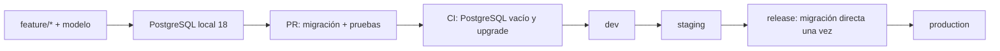

# Flujo de trabajo de base de datos (T10)

Esta es la guía que siguen los tres equipos para cambiar el esquema sin
perder datos ni bloquear el trabajo local. El esquema ejecutable vive en las
migraciones de Django. Neon solo hospeda los tres ambientes cloud: `dev`,
`staging` y `production`.



## Primer día

Cada desarrollador clona Backend y levanta una base local aislada. No se
necesita login, API key ni CLI de Neon.

```sh
git clone https://github.com/GreenITESO-Proyecto-Integrador/GreenITESO-Backend.git
cd GreenITESO-Backend
cp .env.example .env                 # obligatorio; no se commitea
make compose-up
# en otra terminal:
make migrate
make makemigrations-check
make test
```

El contrato de foundation usa `compose.yaml`, PostgreSQL 18 y pytest dentro
del contenedor. `make compose-down` detiene los contenedores y conserva el
volumen local. SQLite no es un fallback válido: no cubre los locks ni las
restricciones que usa el motor de puntos.

## Qué cambia cada equipo

| Dominio | Dueño | Dependencias que debe declarar |
| --- | --- | --- |
| `User`, `UserProfile`, `Clan`, `ClanMembership` | E2 | usuario Django antes de modelos dependientes |
| catálogo, acciones, `ActionLog`, puntos | E1 | `AUTH_USER_MODEL`, clanes e historial congelado |
| campañas, misiones, feed, notificaciones | E3 | usuario, acciones y membresías según el caso |

El usuario personalizado debe estar decidido antes de la primera migración.
Todo modelo que referencia otro dominio usa `settings.AUTH_USER_MODEL` o una
dependencia de migración explícita. P3, P8, P9, P10 y P11 continúan pendientes
de ratificación; las implementaciones exploratorias permanecen en borradores, sin fusionarse
ni aplicarse a ambientes compartidos hasta registrar la decisión.

## Crear y revisar una migración

En la rama `feature/*`:

```sh
make migrate
make makemigrations-check
make test
```

Antes del PR, prueba dos recorridos: una base PostgreSQL vacía y una copia
desechable de la revisión de integración anterior. El PR incluye el modelo,
la migración, sus dependencias y una nota de compatibilidad entre la versión
vieja y la nueva. No se ejecuta `migrate` al arrancar cada instancia de
Gunicorn/Cloud Run.

La lista de revisión es:

- migración limpia desde cero y actualización incremental;
- hojas y dependencias revisadas por los dueños de los modelos referenciados;
- unicidades, `CheckConstraint`, nullabilidad e `on_delete` verificadas en el
  DDL de PostgreSQL;
- referencias históricas de `ActionLog` preservadas, sin recalcular puntos
  desde la membresía actual;
- índices justificados por una consulta real;
- `makemigrations --check --dry-run`, pruebas y CI verdes.

Una hoja incompatible se resuelve en coordinación: rebase sobre la base de
integración, conserva las operaciones y crea una migración de merge solo si
son compatibles. Si no lo son, los dueños escriben una migración de
reconciliación. Nunca se edita, renombra o borra una migración ya aplicada ni
se usa `--fake` para ocultar drift.

## Promoción y conexiones

La promoción planificada de ambientes es `dev` → `staging` → `production`; los
nombres de ramas Git y sus workflows se mantienen en Backend y no deben
confundirse con las ramas Neon. Fusionar Git no fusiona filas de PostgreSQL.
La promoción ejecuta las migraciones
revisadas una vez por ambiente con el mismo contenedor de release, usando la
URL directa y el rol migrador, antes de cambiar tráfico. La aplicación usa la
URL pooled y un rol runtime restringido. El migrador puede crear objetos nuevos
y hacer backfills; las tablas preexistentes siguen perteneciendo a su owner.
Antes de una migration que altere o elimine un objeto existente, la revisión
debe confirmar explícitamente su owner y autorizar un recorrido owner-run o
una estrategia de ownership aprobada. El bootstrap de roles no transfiere
ownership automáticamente.

Los comandos de inspección de Neon siempre son explícitos:

```sh
neon branches list --project-id "$NEON_PROJECT_ID" --output json
neon databases list --project-id "$NEON_PROJECT_ID" --branch dev --output json
```

La URL de conexión se obtiene por Secret Manager/GitHub Environment; no se
imprime en la terminal ni se pega en la documentación.

No se ejecuta `neon env pull` durante onboarding. Las tareas operativas que
necesiten CLI deben identificar proyecto y rama y usar `--no-env-pull` cuando
esa opción exista en la versión instalada. No hay `neon.ts`, Neon Auth,
Neon Object Storage ni ramas automáticas por PR. Microsoft Entra ID se fusionó
en Backend `dev` el 2026-09-22 (PR
[#93](https://github.com/GreenITESO-Proyecto-Integrador/GreenITESO-Backend/pull/93));
el runtime desplegado no está verificado. GCS privado es la propuesta P1
pendiente de integración.

## Si aparece un conflicto

Pausa el PR y avisa a los dos dueños de modelo. No borres migraciones ni
reinicies `staging` para despejarlo. Compara `showmigrations`, la hoja de cada
rama y las operaciones SQL. El revisor decide si basta un merge o si hace
falta una migración explícita de datos. Cada equipo conserva su base local;
`staging` es compartido y no se usa para experimentos destructivos.

La reproducción automatizada de un par de migraciones de equipos es parte de
T10. El script `rehearse-migration-conflict.py` de [Backend PR #29](https://github.com/GreenITESO-Proyecto-Integrador/GreenITESO-Backend/pull/29)
ya reprodujo el conflicto sobre PostgreSQL 18, ejecutó el merge limpio y
conservó las dos filas de datos resultantes. La comunicación y revisión con
los equipos aún está pendiente; la evidencia no autoriza por sí sola una
migración en un ambiente compartido.

Guía introductoria publicada en el [wiki de Backend](https://github.com/GreenITESO-Proyecto-Integrador/GreenITESO-Backend/wiki/Desarrollo-con-PostgreSQL-y-Neon). La comunicación a los tres equipos sigue pendiente.
